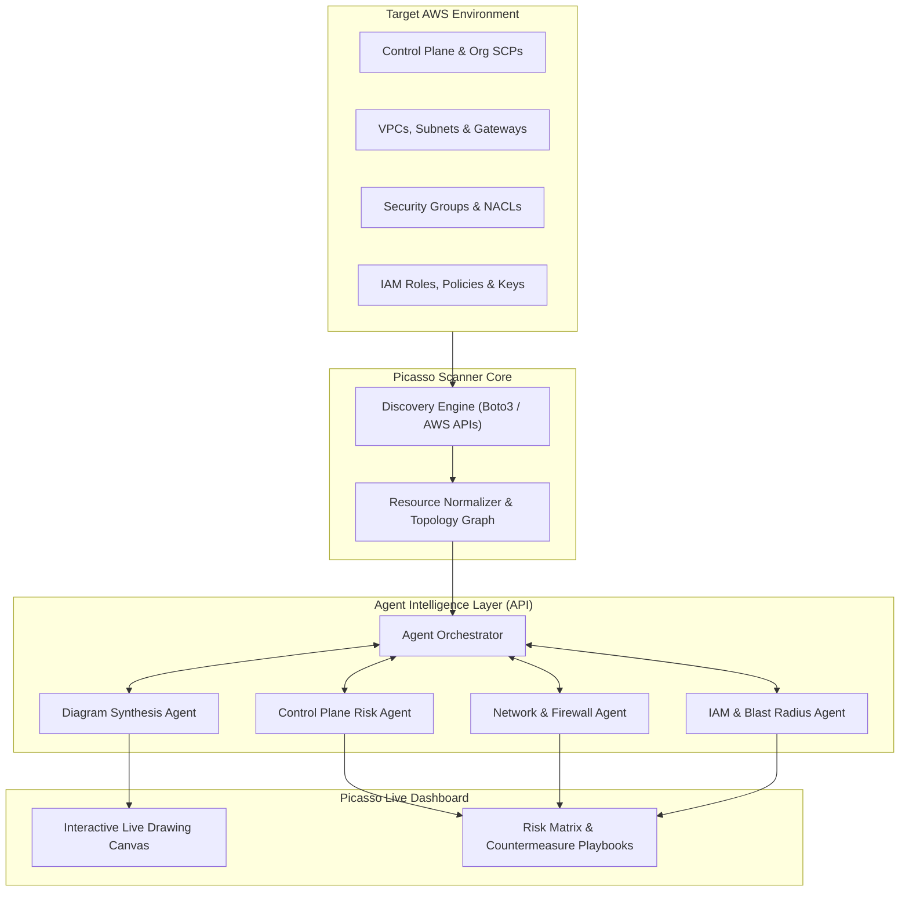

# Picasso 🎨
### AI-Powered AWS Infrastructure Scanner & Live Security Topology Engine

**Picasso** is an intelligent cloud discovery and visualization platform that scans an AWS environment, analyzes its architectural and security posture using specialized AI agents, and dynamically renders a live, interactive diagram of the infrastructure—complete with risk scoring, attack-surface analysis, and actionable countermeasures.

---

## 🌟 Key Capabilities

- **Automated AWS Footprint Discovery**: Discovers resources across regions, covering computing, networking, storage, identity, and control-plane configurations.
- **AI Agent-Driven Synthesis**: Uses API calls to specialized AI agents to translate raw AWS configuration states into contextualized architectural components and security assessments.
- **Live Diagram Generation**: Generates real-time visual infrastructure maps (e.g., React Flow, Mermaid, Excalidraw) depicting subnets, traffic flows, trust boundaries, and asset relationships.
- **Deep Security Risk Evaluation**:
  - **Control Plane & Governance**: Evaluates AWS Organizations, SCPs, CloudTrail integrity, AWS Config, and account-level guardrails.
  - **VPC & Network Perimeter**: Analyzes VPC architectures, public/private subnets, Internet/NAT Gateways, Route Tables, and peering connections.
  - **Firewall & Traffic Filtering**: Pinpoints misconfigured Security Groups (e.g., broad `0.0.0.0/0` ingress), NACL bypasses, and AWS Network Firewall/WAF gaps.
  - **IAM Attack Surface**: Detects privilege escalation vectors, overly permissive policies (`*`), wildcard assume-role relationships, and cross-account risks.
- **Automated Countermeasures**: Provides contextual remediation strategies, least-privilege policy diffs, and IaC (Terraform/CloudFormation) fixes.

---

## 🏗 High-Level Architecture & Workflow

---

## 🔍 Core Security Pillars

### 1. Control Plane & Governance
- **Multi-Account Hierarchy**: Validates AWS Organizations structure, organizational units (OUs), and Service Control Policy (SCP) enforcement.
- **Audit & Logging**: Assesses multi-region CloudTrail logging, log validation, CloudWatch alarm integration, and GuardDuty coverage.
- **Account Baselines**: Flags root user usage, missing MFA on privileged entities, and unmanaged regions.

### 2. VPC & Network Architecture
- **Isolation & Segmentation**: Maps CIDR blocks, public vs. private subnets, Transit Gateways, VPC endpoints, and Direct Connect links.
- **Egress & Ingress Routes**: Highlights unexpected internet exposure paths via Internet Gateways or misrouted NAT configurations.
- **DNS & Flow Logs**: Assesses VPC Flow Logs activation and Route 53 Resolver query logging.

### 3. Firewalls & Perimeter Defenses
- **Security Group Blast Radius**: Flags default security groups in use, unrestricted administration ports (e.g., 22, 3389, 5432, 27017 open to the world), and overly broad egress rules.
- **Network Access Control Lists (NACLs)**: Audits stateless subnet-level perimeter filters.
- **Edge Security**: Examines AWS WAF associations with ALBs/CloudFront distributions and AWS Network Firewall deployments.

### 4. IAM Posture & Threat Modeling
- **Privilege Escalation**: Discovers hidden escalation paths (e.g., `iam:PassRole` + `ec2:RunInstances`, policy version tampering).
- **Cross-Account Trust**: Evaluates resource-based policies (S3 buckets, KMS keys, SQS queues) for external access risks.
- **Credential Hygiene**: Identifies inactive IAM users, active access keys older than 90 days, and excessive AdministratorAccess allocations.

---

## 🛡 Risk & Countermeasure Engine

Each finding detected by the scanning agents is paired with a concrete remediation package:

| Category | Typical Finding | Impact | Recommended Countermeasure |
| :--- | :--- | :--- | :--- |
| **Control Plane** | Multi-Region CloudTrail disabled | Visibility gap during compromise | Deploy Organization-wide CloudTrail with S3 object locking |
| **Network** | Public subnet contains database | Direct exposure to external threats | Migrate database to private DB subnet group; attach isolated SG |
| **Firewall** | Ingress rule allows `0.0.0.0/0` on port 22 | Susceptible to brute force & exploits | Restrict to corporate CIDR or replace with AWS Systems Manager (SSM) |
| **IAM** | Wildcard `Action: "*"` on instance profile | Full lateral movement upon host compromise | Synthesize least-privilege IAM policy based on actual CloudTrail usage |

---

## 🚀 Suggested Project Roadmap

- [ ] **Phase 1: Discovery Engine**
  - Implement read-only Boto3 scanner for IAM, VPC, EC2, S3, and Organizations.
  - Export standardized JSON graph representation of collected resources.
- [ ] **Phase 2: Agent Orchestration API**
  - Build API client interface connecting to LLM/Agent endpoints (Gemini, Claude, or custom agent sidecars).
  - Define structured prompts and schemas for security analysis.
- [ ] **Phase 3: Live Drawing & Visual Synthesis**
  - Translate agent output into structured diagram format (React Flow, Mermaid, or Excalidraw JSON).
  - Implement real-time rendering interface with node drill-downs.
- [ ] **Phase 4: Countermeasures & Automation**
  - Add one-click IaC remediation diff generator (Terraform / CloudFormation).
