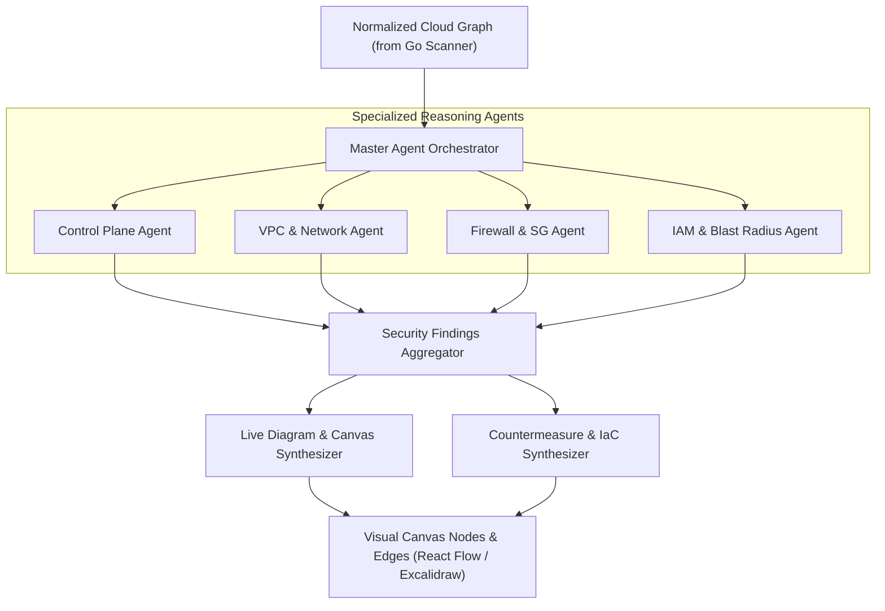

# 02 - Agent Intelligence Layer & Multi-Agent Orchestration (Python)

## 1. Role & Objectives

The `picasso-agent-core` is written in **Python** to leverage the state of the art in LLM orchestration, semantic reasoning, and structured output parsing. It consumes the raw topology graph generated by the Go scanner and coordinates specialized agents to analyze security posture and synthesize diagram layouts.

---

## 2. Multi-Agent Orchestration Architecture

Picasso utilizes a **StateGraph architecture** (implemented via LangGraph / PydanticAI) where a master orchestrator decomposes the graph into domain-specific contexts and feeds them to specialized evaluator agents:



---

## 3. Specialized Agent Specifications

### Agent 1: Control Plane Governance Agent (`ControlPlaneAgent`)
- **Focus**: Account-level integrity and organizational governance.
- **Evaluation Tasks**:
  - Validates if multi-region CloudTrail trails are enabled and encrypted with customer-managed KMS keys.
  - Verifies that root user accounts have no active access keys and require hardware/virtual MFA.
  - Audits SCP policies attached to parent OUs to ensure defensive boundaries are enforced across member accounts.
  - Checks if GuardDuty is active in all enabled regions.

### Agent 2: VPC & Network Architecture Agent (`NetworkTopologyAgent`)
- **Focus**: Network segmentation and perimeter exposure.
- **Evaluation Tasks**:
  - Traverses subnet route tables to classify subnets into: `Public`, `Private with NAT`, and `Isolated`.
  - Pinpoints database or application compute resources unintentionally placed in public subnets with direct Internet Gateway routes.
  - Verifies VPC Peering connections and Transit Gateway routing tables for cross-environment bleed (e.g., Dev connecting directly to Prod).
  - Checks for missing VPC Endpoints for S3 and DynamoDB to keep internal traffic off public IP ranges.

### Agent 3: Firewall & Traffic Filter Agent (`FirewallInspectorAgent`)
- **Focus**: Security Groups, NACLs, and Web Application Firewalls.
- **Evaluation Tasks**:
  - Scans Security Group rules for unrestricted ingress (`0.0.0.0/0` or `::/0`) on sensitive ports (SSH 22, RDP 3389, DB ports 1433, 3306, 5432, 6379, 27017).
  - Flags default security groups that permit arbitrary inbound/outbound communication.
  - Detects overlapping or contradictory NACL rules that introduce false senses of security.
  - Identifies public load balancers that lack attached AWS WAF WebACLs.

### Agent 4: IAM & Blast Radius Agent (`IAMBlastRadiusAgent`)
- **Focus**: Privilege escalation paths, wildcard permissions, and trust boundaries.
- **Evaluation Tasks**:
  - Identifies the top 21 classic AWS IAM privilege escalation paths (e.g., `iam:CreatePolicyVersion`, `iam:SetDefaultPolicyVersion`, `iam:PassRole` + `lambda:CreateFunction`, `sts:AssumeRole` loops).
  - Calculates the blast radius: if host $H$ is compromised, which IAM roles can it assume, and which S3 buckets, secrets, or databases can it access?
  - Audits cross-account trust policies without strict `sts:ExternalId` or explicit principal boundaries.

### Agent 5: Diagram & Visual Synthesis Agent (`DiagramSynthesisAgent`)
- **Focus**: Translating complex infrastructure graphs into clean visual layouts.
- **Evaluation Tasks**:
  - Groups resources into nested visual containers: Account $\rightarrow$ Region $\rightarrow$ VPC $\rightarrow$ Availability Zone $\rightarrow$ Subnet.
  - Assigns semantic colors, icons, and badges based on risk severity (Critical = Red, High = Orange, Medium = Yellow, Safe = Green).
  - Produces coordinates and edge routes optimized for user readability (avoiding overlapping spaghetti edges).

---

## 4. Python Implementation & Data Models

### Directory Structure
```
picasso-agent-core/
├── pyproject.toml
├── src/
│   ├── orchestrator/
│   │   ├── graph.py               # LangGraph state machine definition
│   │   └── state.py               # Shared AgentState schema
│   ├── agents/
│   │   ├── control_plane.py
│   │   ├── network_topology.py
│   │   ├── firewall_inspector.py
│   │   ├── iam_blast_radius.py
│   │   └── diagram_synthesizer.py
│   ├── schemas/
│   │   ├── findings.py            # Pydantic models for risks & countermeasures
│   │   └── canvas.py              # Pydantic models for React Flow / Excalidraw
│   ├── prompts/                   # System instructions and few-shot examples
│   └── tools/                     # Graph query tools (NetworkX graph queries)
└── tests/
```

### Core Pydantic Schemas (`findings.py`)
```python
from enum import Enum
from typing import List, Optional, Dict, Any
from pydantic import BaseModel, Field

class Severity(str, Enum):
    CRITICAL = "CRITICAL"
    HIGH = "HIGH"
    MEDIUM = "MEDIUM"
    LOW = "LOW"
    INFO = "INFO"

class SecurityFinding(BaseModel):
    id: str = Field(description="Unique finding identifier")
    title: str = Field(description="Short human-readable finding summary")
    category: str = Field(description="CONTROL_PLANE | NETWORK | FIREWALL | IAM")
    severity: Severity
    affected_resource_arn: str
    description: str = Field(description="Detailed explanation of the risk")
    attack_vector: Optional[str] = Field(description="How an adversary could exploit this")
    blast_radius_summary: Optional[str] = Field(description="Assets reachable if compromised")
    countermeasure: str = Field(description="Actionable mitigation guidance")
    remediation_iac_diff: Optional[str] = Field(description="Terraform or CloudFormation snippet")

class AnalysisReport(BaseModel):
    account_id: str
    scan_timestamp: str
    overall_risk_score: float = Field(ge=0.0, le=100.0)
    findings: List[SecurityFinding]
    highlighted_attack_paths: List[List[str]] = Field(
        description="Chains of resource ARNs forming an exploit path"
    )
```

---

## 5. Agent Output Guarantees & Guardrails

1. **Deterministic JSON Output**: Agents run with structured output mode (e.g. Gemini `response_schema` or tool calling with Pydantic) to eliminate JSON parsing errors.
2. **Confidence Grounding**: Every finding must cite the exact configuration property in the raw scanner payload (e.g., `IpPermissions[0].IpRanges[0].CidrIp == '0.0.0.0/0'`).
3. **No Hallucinated Resources**: ARNs and resource IDs must exist within the Go scanner's ingested inventory.
