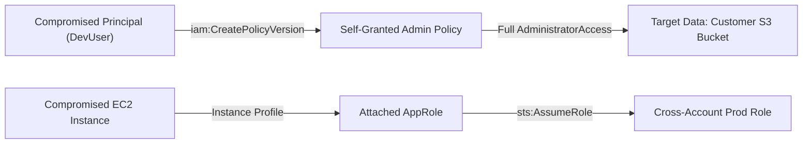

# 03 - Security Threat Models, Evaluation Rules & Risk Rubric

## 1. Overview

This document specifies the rule sets, detection heuristics, and risk-scoring rubric used by Picasso's scanning and agent layers. The threat models are inspired by the **CIS AWS Foundations Benchmark**, **MITRE ATT&CK Cloud Matrix**, and real-world cloud compromise vectors.

---

## 2. Threat Models by Domain

### Pillar A: Control Plane & Account Governance

Adversaries targeting the control plane aim to evade detection, establish persistence, and evade forensic scrutiny.

| Threat ID | Name | Severity | Detection Heuristic | Attack Vector |
| :--- | :--- | :--- | :--- | :--- |
| `CP-001` | CloudTrail Inactivity / Single Region | **CRITICAL** | No trail with `IsMultiRegionTrail == true` and `IsLogging == true`. | Adversary operates in unmonitored regions without detection. |
| `CP-002` | Unencrypted CloudTrail Logs | **HIGH** | `KmsKeyId` is empty or null on active trail. | Insider or compromised S3 credential can inspect raw logs. |
| `CP-003` | Active Root Access Keys | **CRITICAL** | Account summary shows `AccountAccessKeysPresent > 0`. | Root credentials bypassed MFA; full account compromise risk. |
| `CP-004` | Missing GuardDuty Detection | **HIGH** | GuardDuty detector status `Disabled` in any active region. | Absence of automated threat detection for compromised keys/instances. |
| `CP-005` | Unrestricted Member Account Leaves | **MEDIUM** | AWS Organizations lack SCP forbidding `organizations:LeaveOrganization`. | Compromised child account detaches from parent to evade enterprise oversight. |

---

### Pillar B: VPC Architecture & Network Segmentation

Network boundaries protect internal services from direct internet exposure and restrict lateral movement.

| Threat ID | Name | Severity | Detection Heuristic | Attack Vector |
| :--- | :--- | :--- | :--- | :--- |
| `NET-001` | Database in Public Subnet | **CRITICAL** | RDS instance has PubliclyAccessible=true AND sits in subnet routed to IGW. | Direct brute-force or exploitation from internet. |
| `NET-002` | Unrestricted Internet Egress | **MEDIUM** | Subnet default route `0.0.0.0/0` directs to IGW without egress proxy/firewall. | Compromised workload can beacon C2 server or exfiltrate data directly. |
| `NET-003` | VPC Flow Logs Disabled | **HIGH** | VPC has no active `FlowLogs` attached. | Loss of network telemetry; inability to investigate security incidents. |
| `NET-004` | Overly Permissive VPC Peering | **HIGH** | Peering connection exists between `Prod` and `Non-Prod` VPCs without SG filter. | Lateral movement from compromised staging environment into production. |

---

### Pillar C: Firewall, Security Groups & NACLs

Security groups act as virtual stateful firewalls for EC2 instances and container ENIs.

| Threat ID | Name | Severity | Detection Heuristic | Attack Vector |
| :--- | :--- | :--- | :--- | :--- |
| `FW-001` | Unrestricted Remote Access (SSH/RDP) | **CRITICAL** | Ingress rule allows `0.0.0.0/0` on port 22 or 3389. | Credential stuffing, brute-forcing, and zero-day exploitation. |
| `FW-002` | Public Datastore Ingress | **CRITICAL** | Ingress rule allows `0.0.0.0/0` on ports 3306, 5432, 1433, 27017, or 6379. | Direct unauthorized database query, ransom attack, or data exfiltration. |
| `FW-003` | Default Security Group In Use | **HIGH** | Default security group (`default`) has attached ENIs and non-empty rules. | Unexpected lateral communication between disparate workloads. |
| `FW-004` | Overly Broad Egress (All Traffic) | **LOW** | Egress rule allows `0.0.0.0/0` protocol `-1` (all traffic). | Allows reverse shells and unauthorized outbound data channels. |

---

### Pillar D: IAM Privilege Escalation & Blast Radius

IAM represents the true perimeter in AWS. Compromised IAM credentials can result in complete account takeover.

| Threat ID | Name | Severity | Escalation Technique / Risk |
| :--- | :--- | :--- | :--- |
| `IAM-001` | `iam:CreatePolicyVersion` | **CRITICAL** | Principal can create a new version of their own policy containing `Action: "*"` and set it as default. |
| `IAM-002` | `iam:SetDefaultPolicyVersion` | **HIGH** | Principal can switch back to an old dormant policy version that has administrator rights. |
| `IAM-003` | `iam:PassRole` + `lambda:CreateFunction` | **CRITICAL** | Principal passes a privileged role to a new Lambda function and invokes it to perform actions as that role. |
| `IAM-004` | `iam:PassRole` + `ec2:RunInstances` | **CRITICAL** | Principal launches an EC2 instance with an administrator instance profile and extracts metadata credentials. |
| `IAM-005` | Wildcard Administrator (`*` on `*`) | **HIGH** | Policy grants `Action: "*"` on `Resource: "*"`, violating least-privilege principles. |
| `IAM-006` | Insecure Trust Policy (`Principal: "*"`) | **CRITICAL** | IAM Role trust relationship allows any AWS principal to assume the role. |

---

## 3. Composite Risk Scoring Rubric

Picasso computes an **Account Risk Score** from 0 to 100 (where 0 is completely secure, and 100 is critical exposure):

$$\text{Risk Score} = \min\left(100, \sum_{i} w_i \times \text{Count}(\text{Severity}_i)\right)$$

### Weights:
- **Critical Finding ($w = 25$)**: Direct internet exposure of sensitive assets, root key presence, or active privilege escalation paths.
- **High Finding ($w = 10$)**: Disabled security logging, default SG usage, or broad wildcard permissions.
- **Medium Finding ($w = 4$)**: Architectural deficiencies, missing VPC endpoints, or unencrypted assets.
- **Low / Info Finding ($w = 1$)**: Best-practice optimizations, missing tags, or non-critical configuration drift.

### Attack Path Multiplier
If Picasso's agent detects a **continuous attack chain** (e.g. Public Internet $\rightarrow$ SG Ingress 22 $\rightarrow$ EC2 Instance $\rightarrow$ Instance Profile with `iam:PassRole` $\rightarrow$ Administrator Role), the composite risk score for that asset group is multiplied by **$1.5\times$** to reflect immediate exploitability.
