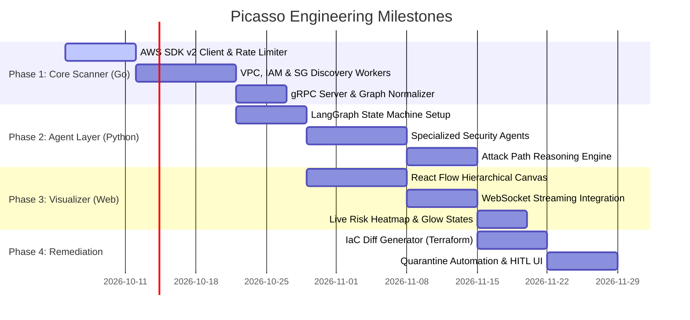

# 07 - Development Roadmap, Monorepo Layout & Tech Stack

## 1. Unified Polyglot Monorepo Structure

To manage both the **Go scanner** and **Python agent subsystem** effectively, Picasso is organized as a modular monorepo:

```
picasso/
├── docs/                           # Architectural specs & design documents
│   ├── 00_system_overview.md
│   ├── 01_scanner_engine_golang.md
│   ├── 02_agent_intelligence_python.md
│   ├── 03_security_threat_model_and_rules.md
│   ├── 04_live_drawing_and_visualization.md
│   ├── 05_countermeasures_and_remediation.md
│   ├── 06_api_and_data_schemas.md
│   └── 07_development_roadmap_and_tech_stack.md
│
├── services/
│   ├── scanner-go/                 # GOLANG: High-concurrency AWS scanner
│   │   ├── cmd/
│   │   ├── internal/
│   │   ├── go.mod
│   │   └── go.sum
│   │
│   ├── agent-py/                   # PYTHON: Multi-agent security & synthesis engine
│   │   ├── src/
│   │   │   ├── agents/
│   │   │   ├── orchestrator/
│   │   │   └── schemas/
│   │   ├── pyproject.toml
│   │   └── requirements.txt
│   │
│   └── web-ui/                     # TYPESCRIPT / REACT: Live Canvas & Dashboard
│       ├── src/
│       │   ├── components/canvas/
│       │   └── hooks/
│       └── package.json
│
├── proto/                          # SHARED: Protocol Buffer definitions
│   └── picasso.proto
│
├── deploy/                         # Local development & container orchestration
│   ├── docker-compose.yml
│   └── localstack-init/            # Seed data for mock AWS testing
│
├── .gitignore
├── Makefile                        # Unified build, test, and run targets
└── README.md
```

---

## 2. Technology Stack Matrix

| Layer | Component | Choice | Reason |
| :--- | :--- | :--- | :--- |
| **Collector** | Language | **Go (Golang 1.23+)** | High concurrency with goroutines, low memory footprint. |
| **Collector** | Cloud SDK | `aws-sdk-go-v2` | Official AWS SDK with automatic retries and pagination. |
| **Inter-Service** | IPC Protocol | **gRPC + Protocol Buffers** | Compact binary streaming of large cloud topology graphs. |
| **AI / Reasoning** | Language | **Python 3.12+** | Rich ecosystem for LLMs, graph algorithms, and prompt chaining. |
| **AI / Reasoning** | Agent Framework | **LangGraph / PydanticAI** | Deterministic state machine orchestration and structured tool calling. |
| **AI / Reasoning** | Foundation Model | **Google Gemini 1.5 Pro / Flash** | Huge context window (1M-2M tokens) capable of ingesting whole VPC graphs. |
| **Graph Analysis** | Topology Engine | **NetworkX** (Python) | Graph traversals, shortest-path calculation for attack vectors. |
| **Frontend** | Framework | **Next.js 14+ / React Flow** | Infinite canvas with custom draggable/zoomable node containers. |
| **Mocking & Dev** | AWS Emulation | **LocalStack** | Fast offline testing without incurring AWS billing or permissions risks. |

---

## 3. Implementation Roadmap



### Phase Details:
- **Phase 1: High-Concurrency Scanner Engine (Go)**:
  - Setup AWS SDK v2, token-bucket rate limiting, and parallel region workers.
  - Deliver normalized JSON/gRPC stream of VPCs, Subnets, SGs, NACLs, IAM Roles, and CloudTrail.
- **Phase 2: Agent Intelligence & Threat Modeling (Python)**:
  - Build LangGraph multi-agent loop with Gemini / LLM tools.
  - Implement the 4 pillars: Control Plane, VPC, Firewalls, and IAM privilege escalation graph traversal.
- **Phase 3: Live Drawing & Visual Synthesis (React / WebSockets)**:
  - Create interactive nested canvas (Account $\rightarrow$ Region $\rightarrow$ VPC $\rightarrow$ Subnet $\rightarrow$ Resources).
  - Stream discovery events in real-time with visual risk badges and animated attack paths.
- **Phase 4: Countermeasures & Automated Remediation**:
  - Implement automated Terraform HCL diff generation for flagged findings.
  - Add human-in-the-loop approval workflow and emergency quarantine triggers.
