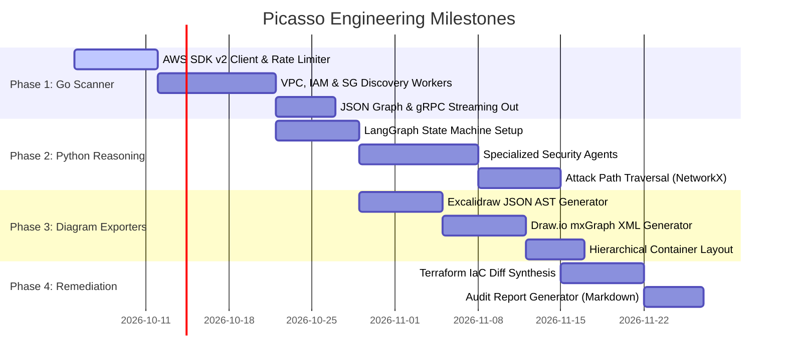

# 07 - Development Roadmap, Monorepo Layout & Tech Stack

## 1. Streamlined Polyglot Monorepo Structure

Without the complexity of a frontend, Picasso is a lightweight, high-performance CLI pipeline:

```
picasso/
├── docs/                           # Architectural specs & design documents
│   ├── 00_system_overview.md
│   ├── 01_scanner_engine_golang.md
│   ├── 02_agent_intelligence_python.md
│   ├── 03_security_threat_model_and_rules.md
│   ├── 04_live_drawing_and_visualization.md
│   ├── 05_countermeasures_and_remediation.md
│   ├── 06_api_and_data_schemas.md
│   └── 07_development_roadmap_and_tech_stack.md
│
├── services/
│   ├── scanner-go/                 # GOLANG: High-concurrency AWS scanner CLI
│   │   ├── cmd/scanner/
│   │   ├── internal/collectors/
│   │   ├── go.mod
│   │   └── go.sum
│   │
│   └── agent-py/                   # PYTHON: Multi-agent reasoner & diagram generator
│       ├── src/
│       │   ├── agents/
│       │   ├── exporters/          # Excalidraw JSON & Draw.io XML generators
│       │   │   ├── excalidraw.py
│       │   │   └── drawio.py
│       │   ├── orchestrator/
│       │   └── schemas/
│       ├── pyproject.toml
│       └── requirements.txt
│
├── proto/                          # SHARED: Protocol Buffer definitions
│   └── picasso.proto
│
├── deploy/                         # Local development & mock AWS
│   ├── docker-compose.yml
│   └── localstack-init/
│
├── output/                         # Output artifacts directory
│   ├── topology.excalidraw         # Visual canvas for Excalidraw
│   ├── architecture.drawio         # Visual diagram for Draw.io
│   ├── security_report.md          # Markdown executive security report
│   └── remediations.tf             # Generated Terraform patches
│
├── .gitignore
├── Makefile                        # Unified build, test, and run CLI targets
└── README.md
```

---

## 2. Technology Stack Matrix

| Layer | Component | Choice | Rationale |
| :--- | :--- | :--- | :--- |
| **Scanner Core** | Language | **Go (Golang 1.23+)** | Maximum goroutine concurrency, zero runtime bloat, fast AWS API querying. |
| **AWS SDK** | Cloud Library | `aws-sdk-go-v2` | Official Go SDK with pagination helpers & exponential backoff. |
| **Inter-Service** | IPC Protocol | **gRPC or JSON Pipe** | Direct binary or stream piping from Go to Python. |
| **AI / Reasoning** | Language | **Python 3.12+** | LangGraph, Gemini API, Pydantic data modeling. |
| **AI Framework** | Orchestrator | **LangGraph / PydanticAI** | Deterministic multi-agent state machines and tool calling. |
| **Diagram Generation**| Excalidraw Exporter | `pydantic` JSON builder | Produces standard `.excalidraw` schema files. |
| **Diagram Generation**| Draw.io Exporter | `lxml` / `xml.etree` | Generates mxGraph XML with native collapsible containers. |
| **Local Mocking** | AWS Emulation | **LocalStack** | Offline testing without AWS costs or permission risks. |

---

## 3. Implementation Roadmap


