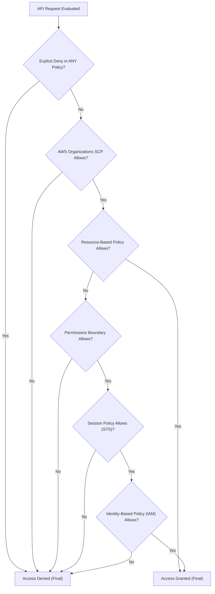
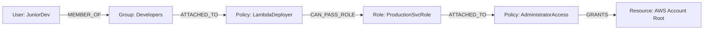

# Deep Dive: IAM Privilege Escalation & Graph Theory Traversal

## 1. Why IAM is the Hardest Problem in Cloud Security

In AWS, identity is the true perimeter. While network firewalls restrict packet flow, IAM governs access to data, compute execution, and administrative APIs. 

Traditional vulnerability scanners fail at IAM because permissions are **multi-layered, context-dependent, and relational**. An account may have no single user with `AdministratorAccess`, yet an attacker can chain 3 benign-looking permissions together to achieve root-level control in seconds.

---

## 2. The AWS Policy Evaluation Logic: How Decisions Are Computed

Before evaluating escalation, one must understand how AWS computes authorization. An API request is denied by default unless an explicit `Allow` exists, but that `Allow` can be overridden by any explicit `Deny`.



### The 6 Policy Layers:
1. **Service Control Policies (SCPs)**: Guardrails set at the AWS Organization level. If an SCP denies `s3:*`, no IAM principal in that account can ever access S3, regardless of admin rights.
2. **Resource-Based Policies**: Attached directly to assets (e.g. S3 Bucket Policy, KMS Key Policy, SQS Policy). Can grant access across accounts directly.
3. **IAM Permissions Boundaries**: Maximum ceiling of permissions an entity can hold. Used extensively when delegating role creation.
4. **Session Policies**: Applied dynamically during `sts:AssumeRole` to further narrow down temporary credentials.
5. **Identity-Based Policies**: Standard managed or inline policies attached to IAM Users, Groups, or Roles.
6. **Explicit Deny Precedence**: An explicit `Deny` in *any* of the above layers instantly halts evaluation with an access denied response.

---

## 3. The Mechanics of Privilege Escalation

Privilege escalation occurs when a principal with limited authority can manipulate their own permissions, create new privileged entities, or execute code in an environment holding higher permissions.

### The Top Escalation Vectors (Rhino Security Labs Framework)

| Technique | Required Permissions | How Exploitation Works |
| :--- | :--- | :--- |
| **Policy Version Switch** | `iam:CreatePolicyVersion` | The principal creates a new version (v2) of their attached policy with `Action: "*"` and sets it as default (`--set-as-default`). |
| **Dormant Version Activation** | `iam:SetDefaultPolicyVersion` | The principal identifies an old, deprecated version of their policy that still had admin rights and switches the default pointer back to it. |
| **PassRole to Lambda** | `iam:PassRole`, `lambda:CreateFunction`, `lambda:InvokeFunction` | The principal creates a Python Lambda function configured with a high-privilege service role (e.g. `arn:...:role/AdminRole`), then invokes the function to create an admin API key for themselves. |
| **PassRole to EC2** | `iam:PassRole`, `ec2:RunInstances` | The principal launches an EC2 instance attached to an instance profile holding an admin role. Once launched, the attacker connects or runs user-data script to query the Instance Metadata Service (IMDSv2) for admin STS tokens. |
| **Glue Dev Endpoint Injection** | `iam:PassRole`, `glue:CreateDevEndpoint` | Similar to EC2, passes an admin role to an AWS Glue development endpoint and extracts credentials. |
| **User Policy Injection** | `iam:PutUserPolicy` or `iam:AttachUserPolicy` | The principal directly attaches an inline or managed policy containing wildcard permissions to their own user identity. |
| **Login Profile Reset** | `iam:CreateLoginProfile` or `iam:UpdateLoginProfile` | A principal with console-disabled status assigns themselves a password to log into the AWS Management Console as an administrative user. |

---

## 4. Modeling IAM as a Directed Graph

To mathematically guarantee detection of complex escalation paths, Picasso models the entire AWS identity landscape as a **Directed Multigraph** $G = (V, E)$:

### Vertices ($V$):
- $\text{User}(u)$, $\text{Group}(g)$, $\text{Role}(r)$
- $\text{Policy}(p)$, $\text{InstanceProfile}(ip)$
- $\text{Resource}(res)$ (e.g. S3 buckets, EC2 instances, Lambda functions)

### Edges ($E$):
- $\text{MEMBER\_OF}: \text{User} \rightarrow \text{Group}$
- $\text{ATTACHED\_TO}: \text{Policy} \rightarrow \text{Role} \mid \text{User} \mid \text{Group}$
- $\text{ASSUMES\_ROLE}: \text{Principal} \xrightarrow{\text{sts:AssumeRole}} \text{Role}$
- $\text{PASSES\_ROLE}: \text{Principal} \xrightarrow{\text{iam:PassRole}} \text{Compute Service}$
- $\text{CAN\_ESCALATE\_TO}: \text{Principal} \xrightarrow{\text{Exploit Vector}} \text{High-Privilege Role}$



---

## 5. Finding Escalation Chains with Dijkstra & Breadth-First Search (BFS)

Picasso uses a deterministic graph engine (Python `networkx` paired with Go adjacency matrices) to find the shortest, most exploitable attack path.

### The Algorithm:
1. **Adjacency Matrix Construction**: Build the graph from Go scanner's normalized IAM nodes and trust policies.
2. **Target Node Identification**: Mark all nodes possessing effective `AdministratorAccess` or dangerous asterisks (`*`) as $\text{Target Set } T$.
3. **Source Node Traversal**: For any compromised or external entry node $S$, run **Breadth-First Search (BFS)** or **Dijkstra's Algorithm** (where edge weight represents exploitation complexity: e.g. PassRole = weight 1, password brute force = weight 10).
4. **Path Extraction**: Output the exact sequence of ARNs and IAM actions required to traverse from $S$ to $T$.

```python
import networkx as nx

def find_shortest_escalation_path(graph: nx.DiGraph, start_principal: str, admin_targets: set):
    """
    Deterministically computes the shortest privilege escalation chain
    from a starting principal to any administrative target.
    """
    shortest_path = None
    min_hops = float("inf")
    
    for target in admin_targets:
        if nx.has_path(graph, start_principal, target):
            path = nx.shortest_path(graph, source=start_principal, target=target)
            if len(path) < min_hops:
                min_hops = len(path)
                shortest_path = path
                
    return shortest_path
```

---

## 6. How Recruiters Evaluate This Knowledge

When discussing this in technical interviews, highlight:
1. **You know LLMs cannot calculate graph reachability reliably**: You use deterministic graph algorithms to prove paths exist.
2. **You understand effective permissions**: You account for SCPs, Permissions Boundaries, and trust policy conditions (`sts:ExternalId`).
3. **You can automate remediation**: Once Picasso detects the chain, the agent generates a specific IAM policy diff that removes the exact permission enabling the hop (e.g. scoping `iam:PassRole` to only specific resource ARNs with `iam:PassedToService` conditions).
