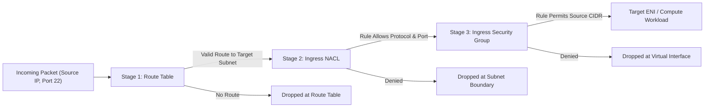

# Deep Dive: Network Reachability & Firewall Matrix Analysis

## 1. The False Sense of Security in Cloud Networking

Cloud network security errors frequently stem from misunderstanding the interplay between **stateful firewalls (Security Groups)**, **stateless packet filters (NACLs)**, and **routing tables (Route Tables & Gateways)**.

A developer may believe a service is private because its Security Group appears restricted, yet an overly broad NACL or a misconfigured Transit Gateway route exposes internal subnets to external ingress or cross-VPC lateral movement.

---

## 2. Security Groups vs. NACLs: Fundamental Differences

| Property | Security Groups (SG) | Network Access Control Lists (NACL) |
| :--- | :--- | :--- |
| **Operating Layer** | Hypervisor / Virtual Network Interface (ENI) level | Subnet boundary level |
| **State Tracking** | **Stateful**: Inbound allowed traffic automatically permits outbound return response traffic, regardless of egress rules. | **Stateless**: Inbound and outbound traffic must be explicitly permitted in both directions. |
| **Rule Processing** | Evaluates **all rules** before granting access. No explicit deny rules (deny is default). | Evaluates rules in **numerical order (1-32766)**. First match determines Allow or Deny. |
| **Default Configuration** | Default SG: Allows all inbound from instances in same SG, all outbound. Custom SG: Denies all inbound, allows all outbound. | Default NACL: Allows all traffic in and out. Custom NACL: Denies all traffic in and out until rules added. |

---

## 3. The 3-Stage Reachability Pipeline

To prove an external host or an internal adversary can reach a port on an EC2 instance or RDS database, traffic must satisfy **all three stages** of the network stack:



### Stage 1: Route Table Evaluation (Longest Prefix Match)
AWS VPC routing relies strictly on **Longest Prefix Match (LPM)**:
1. If destination is `10.0.1.25/32`, and the route table has:
   - `10.0.0.0/16` $\rightarrow$ `local`
   - `0.0.0.0/0` $\rightarrow$ `igw-xxxx`
2. Traffic to `10.0.1.25` is routed **internally** because `/16` is more specific than `/0`.
3. If an instance sits in a subnet where `0.0.0.0/0` routes to a NAT Gateway or lacks an IGW route, it cannot be reached directly from the internet, even if its Security Group permits `0.0.0.0/0:22`.

### Stage 2: Subnet-Level NACL Filtering
- If NACL Rule 100 allows TCP 22 from `0.0.0.0/0`, but Rule 50 explicitly denies TCP 22 from `203.0.113.0/24`, traffic from that IP is dropped.
- **Return Traffic Trap**: Because NACLs are stateless, return traffic must be permitted outbound via **ephemeral ports** (typically TCP 1024–65535). A misconfigured outbound NACL rule silently breaks TCP handshakes.

### Stage 3: Security Group Enforcement
- Evaluated at the ENI attached to the compute node.
- If multiple Security Groups are attached to a single ENI, AWS takes the **union of all permissive rules**. If SG-A allows port 80 and SG-B allows port 22, the instance accepts both port 80 and port 22.

---

## 4. Picasso's Deterministic Reachability Solver

Picasso does not guess reachability using an LLM. It calculates network accessibility using a **Boolean Constraint Solver**:

$$\text{Reachable}(S, D, P) = \text{Route}(S \rightarrow D) \land \text{NACL}_{\text{in}}(D, P) \land \text{SG}_{\text{in}}(D, P) \land \text{NACL}_{\text{out}}(D, \text{ephemeral})$$

Where:
- $S$: Source entity or CIDR (e.g. `0.0.0.0/0` or `10.0.2.14/32`)
- $D$: Destination entity (e.g. `i-0a1b2c3d4e`)
- $P$: Target protocol & port (e.g. TCP 5432)

### Pseudocode Implementation (Go / Python):
```python
def check_network_reachability(source_cidr: str, target_instance: Instance, target_port: int) -> bool:
    # 1. Route Table verification
    route_table = get_route_table(target_instance.subnet_id)
    if not has_valid_ingress_route(route_table, source_cidr):
        return False
        
    # 2. NACL verification (Inbound + Outbound return)
    nacl = get_nacl(target_instance.subnet_id)
    if not nacl.evaluates_allow(source_cidr, port=target_port, direction="INBOUND"):
        return False
    if not nacl.evaluates_allow(source_cidr, port="1024-65535", direction="OUTBOUND"):
        return False
        
    # 3. Security Group Union verification
    security_groups = target_instance.attached_security_groups
    sg_allows = any(sg.permits(source_cidr, target_port) for sg in security_groups)
    
    return sg_allows
```

---

## 5. Visualizing the Reachability Matrix in Draw.io & Excalidraw

When a workload is mathematically proven reachable from the public internet, Picasso highlights this with high-contrast visual cues:

1. **Vulnerable Ingress Vector**: Renders an animated dashed red arrow from the Internet Gateway directly to the workload.
2. **Threat Callout Box**: Places a red alert box adjacent to the instance listing:
   - Discovered Ingress Port: e.g. `TCP 3306 (MySQL)`
   - Open CIDR: `0.0.0.0/0`
   - Active SG ID: `sg-0abc1234`
3. **Remediation Suggestion**: Includes an inline recommendation (e.g. "Move instance to Private Subnet `subnet-priv-01` and detach `sg-0abc1234`").
