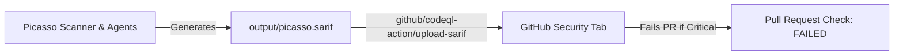

# Deep Dive: Enterprise Security Standards (SARIF, ASFF & MITRE ATT&CK)

## 1. Why Standards Matter to DevSecOps Teams

In enterprise environments, proprietary alert dashboards are rarely adopted. Modern DevSecOps teams require automated security scanners to emit findings in **standard industry interchange formats** that feed directly into:
1. **GitHub Code Scanning & Pull Request Checks** (via **SARIF**).
2. **AWS Security Hub & Enterprise SIEMs** like Splunk/Datadog (via **ASFF**).
3. **SOC & Threat Hunting Dashboards** (mapped to the **MITRE ATT&CK for Cloud Framework**).

By implementing these standards, Picasso functions as an enterprise-grade security tool rather than an isolated toy project.

---

## 2. SARIF (Static Analysis Results Interchange Format)

**SARIF** (OASIS standard) is the native format consumed by **GitHub Code Scanning**. When Picasso emits `output/picasso.sarif`, GitHub Actions can upload it directly, causing detected cloud misconfigurations to appear right in the **GitHub Security tab** alongside code scanning alerts.



### Example: Picasso SARIF Payload
```json
{
  "$schema": "https://raw.githubusercontent.com/oasis-tcs/sarif-spec/master/Schemata/sarif-schema-2.1.0.json",
  "version": "2.1.0",
  "runs": [
    {
      "tool": {
        "driver": {
          "name": "Picasso-Cloud-Security",
          "version": "1.0.0",
          "rules": [
            {
              "id": "PICASSO-FW-001",
              "name": "UnrestrictedSshIngress",
              "shortDescription": {
                "text": "Security group permits SSH (port 22) from 0.0.0.0/0"
              },
              "properties": {
                "tags": ["cloud", "network", "mitre-t1078.004"],
                "precision": "high"
              }
            }
          ]
        }
      },
      "results": [
        {
          "ruleId": "PICASSO-FW-001",
          "level": "error",
          "message": {
            "text": "Security group sg-0123456789 permits unrestricted inbound SSH traffic from the public internet (0.0.0.0/0)."
          },
          "locations": [
            {
              "physicalLocation": {
                "artifactLocation": {
                  "uri": "aws://123456789012/us-east-1/security-group/sg-0123456789"
                }
              }
            }
          ]
        }
      ]
    }
  ]
}
```

---

## 3. MITRE ATT&CK for Cloud Matrix Mapping

Picasso maps every heuristic rule directly to the **MITRE ATT&CK Cloud Matrix**, allowing security operations centers (SOCs) to correlate cloud infrastructure weaknesses with active threat actor tactics:

| Finding ID | Finding Description | MITRE Tactic | MITRE Technique ID & Name |
| :--- | :--- | :--- | :--- |
| `FW-001` | SSH open to `0.0.0.0/0` | Initial Access | **T1190**: Exploit Public-Facing Application |
| `IAM-001` | `iam:CreatePolicyVersion` | Privilege Escalation | **T1078.004**: Valid Accounts (Cloud Accounts) |
| `IAM-003` | `iam:PassRole` to Lambda | Privilege Escalation / Persistence | **T1098.001**: Account Manipulation: Additional Cloud Credentials |
| `CP-001` | CloudTrail Disabled | Defense Evasion | **T1562.008**: Impair Defenses: Disable Cloud Logs |
| `NET-002` | Direct Egress to Internet | Exfiltration / C2 | **T1048**: Exfiltration Over Alternative Protocol |

---

## 4. ASFF (AWS Security Finding Format)

For enterprise multi-account environments using **AWS Security Hub**, Picasso can emit findings matching the AWS Security Finding Format schema. This allows security teams to pipe findings into Amazon EventBridge, triggering automated Lambda remediations or PagerDuty alerts:

```json
{
  "SchemaVersion": "2018-10-08",
  "Id": "arn:aws:securityhub:us-east-1:123456789012:finding/PICASSO-IAM-001",
  "ProductArn": "arn:aws:securityhub:us-east-1::product/custom/picasso",
  "GeneratorId": "picasso-iam-engine",
  "AwsAccountId": "123456789012",
  "Types": [
    "Software and Configuration Checks/AWS Security Best Practices/IAM"
  ],
  "CreatedAt": "2026-10-02T00:00:00Z",
  "UpdatedAt": "2026-10-02T00:00:00Z",
  "Severity": {
    "Label": "CRITICAL",
    "Normalized": 90
  },
  "Title": "IAM Privilege Escalation Chain Detected",
  "Description": "Principal DevUser can escalate privileges to AdministratorAccess via iam:CreatePolicyVersion on policy arn:aws:iam::123456789012:policy/DevPolicy.",
  "Remediation": {
    "Recommendation": {
      "Text": "Remove iam:CreatePolicyVersion or restrict with condition keys.",
      "Url": "https://docs.aws.amazon.com/IAM/latest/UserGuide/best-practices.html"
    }
  },
  "Resources": [
    {
      "Type": "AwsIamUser",
      "Id": "arn:aws:iam::123456789012:user/DevUser",
      "Partition": "aws",
      "Region": "us-east-1"
    }
  ]
}
```

---

## 5. Summary: How This Accelerates Your Interview

When an interviewer asks how your tool integrates with real-world infrastructure pipelines:

1. **Shift-Left**: In CI/CD, Picasso outputs **SARIF**, failing pull requests directly in GitHub with inline code annotations.
2. **Shift-Right (Runtime)**: In running environments, Picasso emits **ASFF** to AWS Security Hub and logs to SIEMs.
3. **Threat Classification**: Findings are categorized by **MITRE ATT&CK**, speaking the universal language of security operations teams.
